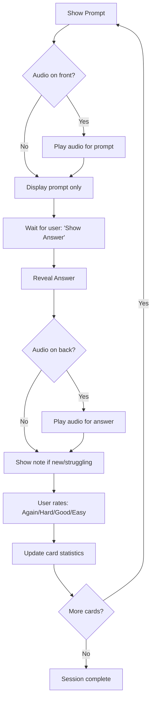

# SRS System Technical Specification
## Evidence-Based Implementation Guide for Coding Agents

---

## 1. THE SCIENCE: Spacing Intervals & Desirable Difficulty

### 1.1 Core Principle: The Spacing Effect
The spacing effect, discovered by Hermann Ebbinghaus in the 1880s, demonstrates that information is better retained when review sessions are distributed over time rather than massed together. The optimal spacing interval increases with each successful recall.

**Critical Finding:** Research shows that spaced repetition with expanding intervals forces increasingly difficult retrieval, creating deeper processing in long-term memory.

### 1.2 Optimal Spacing Intervals (SuperMemo SM-2 Based)

Your SRS algorithm should implement **expanding intervals** based on user performance:

#### Initial Learning Phase (New Cards)
```
Review 1: Immediate (within same session)
Review 2: 1 day later
Review 3: 3 days later
Review 4: 7 days later
```

#### Retention Phase (Mastered Cards)
```
Easy recall: Multiply interval by 2.5
Good recall: Multiply interval by 2.0  
Hard recall: Multiply interval by 1.2
Failed recall: Reset to 1 day
```

**Maximum interval cap:** 180 days (6 months)  
**Minimum interval floor:** 1 day

#### Example Progression:
```
Day 0: New card introduced
Day 1: First review → Student responds "Good"
Day 3: Second review (1 × 2.0 = 2 days, rounded to 3)
Day 9: Third review (3 × 2.0 = 6 days, rounded to 9)
Day 27: Fourth review (9 × 2.0 = 18 days)
Day 72: Fifth review (27 × 2.0 = 54 days, capped)
```

### 1.3 Desirable Difficulty: The Sweet Spot

**Research-backed target metrics:**
- **Optimal success rate:** 70-85% correct on review cards
- **Optimal response time:** 3-8 seconds for production cards
- **New cards per day:** Maximum 10-15 (prevents cognitive overload)
- **Review cards per day:** 30-50 (sustainable long-term)

#### Performance-Based Difficulty Calibration

**Too Easy (>90% success rate):**
- **Problem:** Insufficient challenge, weak memory consolidation
- **Action:** Increase interval multiplier by 0.2
- **Action:** Introduce more production-type cards
- **Action:** Add contextual variations of known chunks

**Too Hard (<65% success rate):**
- **Problem:** Demotivation, excessive cognitive load
- **Action:** Decrease interval multiplier by 0.2
- **Action:** Add more scaffolding in the `note` field
- **Action:** Include recognition cards before production

**Sweet Spot (70-85% success rate):**
- **Result:** Effortful retrieval → long-term memory enhancement
- **Result:** Student experiences achievable challenge
- **Result:** Motivation maintained through success + effort

### 1.4 Critical Algorithm Requirements

#### A. Interleaving (Mixing Card Types)
**DO NOT** present cards in blocks (all production, then all recognition).

**CORRECT APPROACH:**
```
Session queue: 
[Production] → [Contextual] → [Recognition] → [Production] → [Contextual] → [Production]
```

**Why:** Research shows interleaving creates desirable difficulties that improve discrimination and long-term learning. Students learn better when they mix different skills and language areas in one study session.

#### B. Avoiding the "Feeling of Knowing" Trap
Students must **produce the answer** before seeing it. The system should:
1. Display the prompt
2. Wait for user interaction (tap/click "Show Answer")
3. **THEN** reveal the answer
4. Require self-assessment: Easy / Good / Hard / Again

**Critical:** Never auto-flip or show answers prematurely. Active recall requires genuine retrieval effort.

#### C. Daily Review Caps
```javascript
const DAILY_LIMITS = {
  newCards: 15,           // Maximum new cards per day
  reviewCards: 50,        // Maximum reviews per day
  studyTimeMinutes: 25    // Suggest break after 25 minutes
}
```

**Why:** Research shows consistency and habit reap more gains than marathon sessions. Daily practice beats weekly cramming.

#### D. Lapsed Card Handling
When a card is failed (student answers "Again"):
```javascript
if (card.interval >= 7) {
  card.interval = 1;           // Reset to 1 day
  card.status = "relearning";  // Mark for intensive review
  card.lapseCount += 1;        // Track difficulty
}
```

If `lapseCount > 3`, flag the card as "problematic" for teacher review (may need better prompt/note).

---

## 2. CARD DATA STRUCTURE

### 2.1 CSV Schema

Your system will import CSV files with this exact structure:

```csv
prompt,answer,note,audio,audio_side
```

### 2.2 Field Specifications

#### **Field: `prompt`**
**Purpose:** Trigger for active recall  
**Type:** String (max 200 characters)  
**Content Guidelines:**
- **Production cards (50%):** French L1 prompt or situational cue
  - Example: `"Comment dire 'bonjour' informellement ?"`
  - Example: `"You're meeting a colleague—what do you say?"`
- **Recognition cards (20%):** English chunk
  - Example: `"What's up?"`
- **Contextual cards (30%):** Short roleplay scenario with emoji
  - Example: `"☕ You're ordering coffee. The barista asks what size. You want medium—what do you say?"`

**Rules:**
- Keep under 20 words for optimal cognitive load
- Use clear, unambiguous language
- For L1 prompts, ensure translation is precise
- For situational cues, include necessary context

**CSV Handling:**
- Escape commas: Wrap in quotes if prompt contains commas
- Escape quotes: Use `""` for quotes within quoted strings
- Example: `"Comment dire ""salut"" en anglais ?"`

#### **Field: `answer`**
**Purpose:** The target English chunk the student must recall  
**Type:** String (max 100 characters)  
**Content Guidelines:**
- **Production/Contextual:** The exact phrase to produce
  - Example: `"Hey there!"`
  - Example: `"I'd like a medium coffee, please"`
- **Recognition:** L1 translation + English example
  - Example: `"Salut ! / Quoi de neuf ? | Example: Hey! What's up?"`

**Rules:**
- ONLY the target chunk (no explanations)
- For recognition cards: Follow format `L1 translation | Example: English sentence`
- Natural, conversational English at A2/B1 level
- Avoid archaic or overly formal phrases

#### **Field: `note`**
**Purpose:** Scaffolding for new cards (first-time learners)  
**Type:** String (max 300 characters)  
**Content Guidelines:**
- **Production:** Example sentence + usage tip
  - Example: `"Hey there! How's it going? – Use with friends for casual vibe."`
- **Contextual:** Cultural context or alternatives
  - Example: `"British: 'Could I have a medium coffee?' American: 'I'll take a medium coffee.' Both polite."`
- **Recognition:** Register information
  - Example: `"Very informal. Use with close friends only, not at work."`

**Rules:**
- Always include ONE example sentence in English
- Add ONE actionable tip (register, collocation, common mistake)
- Keep concise (students should read in <5 seconds)
- Front-load the most important information

**Display Logic:**
```javascript
// Show note when:
if (card.reviewCount === 0 || card.lastInterval < 3) {
  displayNote(card.note);
}
// Hide note when:
else if (card.reviewCount > 3 && card.successRate > 0.8) {
  hideNote(); // Student has mastered, no scaffolding needed
}
```

#### **Field: `audio`**
**Purpose:** File path/URL for TTS-generated audio  
**Type:** String (URL or empty)  
**Initial State:** Empty in CSV (`,,`)  
**Runtime Handling:**
```javascript
// On card import/first load:
if (card.audio === '' || card.audio === null) {
  card.audio = await generateTTS(getAudioContent(card));
  saveCard(card);
}

function getAudioContent(card) {
  if (card.audio_side === 'front') {
    return card.prompt;
  } else if (card.audio_side === 'back') {
    return card.answer;
  }
  return null; // No audio for this card
}
```

**Audio Generation Requirements:**
- Use Web Speech API or cloud TTS service
- Voice: Natural, clear English (not robotic)
- Speed: 0.9x (slightly slower for learners)
- Format: MP3 or WebM for browser compatibility
- Store locally or CDN URL in `audio` field after generation

#### **Field: `audio_side`**
**Purpose:** Determines when and where audio plays for optimal pronunciation learning  
**Type:** Enum (`"front"` | `"back"` | `"both"`)  
**Values:**
- `"front"` → Play audio when prompt is displayed
- `"back"` → Play audio when answer is revealed
- `"both"` → Play audio on both front (prompt) and back (answer)

**CRITICAL PEDAGOGICAL GOAL:** Students should READ and LISTEN to the target English chunk simultaneously to reinforce correct pronunciation and build sound-text associations.

**Logic by Card Type:**

| Card Type      | audio_side | Front Audio Plays | Back Audio Plays | Pedagogical Reason |
|----------------|------------|-------------------|------------------|-------------------|
| Production (L1 → EN) | `"back"` | No | **Yes** (answer = English chunk) | Student reads and hears target English pronunciation when answer revealed |
| Production (Situational EN → EN) | `"both"` | Yes (prompt = scenario) | **Yes** (answer = English chunk) | Student hears scenario for comprehension, then reads/hears target English |
| Contextual Action | `"both"` | Yes (prompt = roleplay) | **Yes** (answer = English response) | Student hears situation, then reads/hears natural English response |
| Recognition (EN → L1) | `"front"` | **Yes** (prompt = English chunk) | No | Student reads and hears English chunk simultaneously (key recognition moment) |

**Example CSV entries:**
```csv
prompt,answer,note,audio,audio_side
"Comment dire 'salut' ?","Hey there!","Hey there! How's it going? – Casual greeting.",,back
"You see a colleague in the morning. What do you say?","Good morning!","Good morning! How are you today? – Standard workplace greeting.",,both
"😊 What's up?","Salut ! / Quoi de neuf ? | Example: Hey! What's up?","Very informal. Friends only.",,front
```

**Implementation Note:**
```javascript
// When displaying card front:
if (card.audio_side === 'front' || card.audio_side === 'both') {
  if (card.audio_side === 'front') {
    // Recognition card: play prompt audio
    playAudio(card.audio.front);
  } else {
    // Contextual/Situational production: play scenario audio
    playAudio(card.audio.front);
  }
}

// When revealing answer:
if (card.audio_side === 'back' || card.audio_side === 'both') {
  // Play target English chunk pronunciation
  playAudio(card.audio.back);
}
```

---

## 3. SYSTEM BEHAVIOR: THE STUDY SESSION FLOW

### 3.1 Session Initialization

```javascript
function initializeSession() {
  const session = {
    dueCards: getDueCards(),        // Cards due for review today
    newCards: getNewCards(15),      // Max 15 new cards
    queue: []
  };
  
  // Interleave: mix new and due cards
  session.queue = interleave(session.newCards, session.dueCards);
  
  // Shuffle to prevent pattern prediction
  session.queue = shuffle(session.queue);
  
  return session;
}
```

### 3.2 Card Presentation Flow



### 3.3 User Rating System

**Four-button response:**

| Button | Meaning | Interval Adjustment | Use Case |
|--------|---------|---------------------|----------|
| **Again** | Complete fail | interval = 1 day | Could not recall at all |
| **Hard** | Struggled but got it | interval × 1.2 | Took >10 seconds, uncertain |
| **Good** | Recalled with effort | interval × 2.0 | Took 3-8 seconds, confident |
| **Easy** | Instant recall | interval × 2.5 | Took <3 seconds, automatic |

**Update algorithm:**
```javascript
function updateCard(card, rating) {
  card.reviewCount += 1;
  card.lastReviewed = Date.now();
  
  switch(rating) {
    case 'again':
      card.lapseCount += 1;
      card.interval = 1;
      card.ease = Math.max(1.3, card.ease - 0.2); // Reduce ease factor
      break;
    case 'hard':
      card.interval = Math.ceil(card.interval * 1.2);
      card.ease = Math.max(1.3, card.ease - 0.15);
      break;
    case 'good':
      card.interval = Math.ceil(card.interval * card.ease);
      break;
    case 'easy':
      card.interval = Math.ceil(card.interval * card.ease * 1.3);
      card.ease = Math.min(2.5, card.ease + 0.15); // Increase ease factor
      break;
  }
  
  // Cap intervals
  card.interval = Math.min(180, card.interval);
  card.nextReview = Date.now() + (card.interval * 24 * 60 * 60 * 1000);
  
  saveCard(card);
}
```

### 3.4 Statistics to Track (Per Card)

```javascript
const cardSchema = {
  id: String,
  prompt: String,
  answer: String,
  note: String,
  audio: String,
  audio_side: String,
  
  // Learning metrics
  reviewCount: Number,        // Total times reviewed
  lapseCount: Number,         // Times failed
  successRate: Number,        // Percentage correct
  averageResponseTime: Number, // Milliseconds
  
  // Scheduling
  interval: Number,           // Days until next review
  ease: Number,               // Multiplier (default 2.0)
  nextReview: Timestamp,      // Unix timestamp
  lastReviewed: Timestamp,
  
  // Status
  status: Enum['new', 'learning', 'review', 'relearning'],
  createdAt: Timestamp
}
```

---

## 4. AUDIO FEATURE: DETAILED SPECIFICATION

### 4.1 CSV Import Behavior

When importing CSV:
```javascript
async function importCSV(file) {
  const cards = parseCSV(file);
  
  for (const card of cards) {
    // Audio field is empty in CSV
    if (!card.audio && card.audio_side) {
      // Create audio object to store multiple audio files
      card.audio = {};
      
      // Generate front audio if needed
      if (card.audio_side === 'front' || card.audio_side === 'both') {
        const frontText = card.prompt;
        card.audio.front = await generateTTS(frontText, 'front', card);
      }
      
      // Generate back audio if needed
      if (card.audio_side === 'back' || card.audio_side === 'both') {
        const backText = card.answer;
        card.audio.back = await generateTTS(backText, 'back', card);
      }
    }
    
    await saveCard(card);
  }
}
```

### 4.2 TTS Generation Requirements

**CRITICAL PEDAGOGICAL PRINCIPLE:** The primary goal is for students to **read and listen to the target English chunk simultaneously**. This builds strong sound-text associations crucial for pronunciation and listening comprehension.

**For Production Cards with L1 Prompts (`audio_side: "back"`):**
- **Front:** No audio (student reads French prompt, no audio needed)
- **Back:** Generate audio for `answer` field (target English chunk)
- **Purpose:** When answer is revealed, student reads "take a break" AND hears it pronounced
- **TTS config:** `lang="en-US"` or `lang="en-GB"`, rate: 0.9x

**For Production Cards with Situational Prompts (`audio_side: "both"`):**
- **Front:** Generate audio for `prompt` field (English scenario)
- **Back:** Generate audio for `answer` field (target English chunk)
- **Purpose:** Student hears scenario (comprehension support), then reads/hears target chunk
- **TTS config:** Both use English, rate: 0.9x

**For Contextual Action Cards (`audio_side: "both"`):**
- **Front:** Generate audio for `prompt` field (roleplay situation)
- **Back:** Generate audio for `answer` field (English response)
- **Purpose:** Student hears situation, then reads/hears natural response with correct intonation
- **TTS config:** Both use English, rate: 0.9x

**For Recognition Cards (`audio_side: "front"`):**
- **Front:** Generate audio for `prompt` field (English chunk with emoji)
- **Back:** No audio (student has already processed the target chunk)
- **Purpose:** KEY MOMENT - student reads "I'm swamped" AND hears it pronounced simultaneously
- **TTS config:** `lang="en-US"` or `lang="en-GB"`, rate: 0.9x
- **Special handling:** Skip emoji characters, read only the English text

**TTS Implementation Example:**
```javascript
async function generateTTS(text, side, card) {
  let lang = 'en-US';
  let processedText = text;
  
  // Handle L1 prompts for production cards
  if (side === 'front' && card.audio_side === 'both' && detectLanguage(text) === 'french') {
    lang = 'fr-FR';
  }
  
  // Handle recognition cards: extract English only, remove emoji
  if (side === 'front' && card.audio_side === 'front') {
    // Remove emoji from recognition card prompts
    processedText = text.replace(/[\u{1F300}-\u{1F9FF}]/gu, '').trim();
  }
  
  // Handle answer field for recognition cards: extract English example
  if (side === 'back' && text.includes('|')) {
    processedText = text.split('|')[1].replace('Example:', '').trim();
  }
  
  // Generate audio
  const audioURL = await textToSpeech(processedText, {
    lang: lang,
    rate: 0.9,  // Slightly slower for learners
    pitch: 1.0,
    voice: 'natural'
  });
  
  return audioURL;
}
```

### 4.3 Playback Behavior

**Automatic playback:**
```javascript
function displayCard(card, side) {
  // Front side display
  if (side === 'front') {
    if (card.audio_side === 'front' || card.audio_side === 'both') {
      // Recognition cards or Contextual/Situational cards
      playAudio(card.audio.front);
    }
  }
  
  // Back side display (answer reveal)
  if (side === 'back') {
    if (card.audio_side === 'back' || card.audio_side === 'both') {
      // Production cards or Contextual cards
      // CRITICAL: This is when student reads AND hears target English
      playAudio(card.audio.back);
    }
  }
}
```

**Manual replay:**
- Include a 🔊 speaker icon button on relevant side
- **Front side:** Show speaker icon if `audio_side` is `"front"` or `"both"`
- **Back side:** Show speaker icon if `audio_side` is `"back"` or `"both"`
- Allow unlimited replays during study session
- Track replay count for analytics (high replays = pronunciation difficulty)

### 4.4 Audio Storage

**Data Structure:**
```javascript
const cardSchema = {
  // ... other fields ...
  audio: {
    front: String,  // URL or null (for front audio)
    back: String    // URL or null (for back audio)
  },
  audio_side: Enum['front', 'back', 'both']
}
```

**Options:**
1. **LocalStorage/IndexedDB:** Store base64-encoded audio for offline access
2. **Cloud Storage:** Store in CDN, save URLs in `audio.front` and `audio.back`
3. **On-demand generation:** Generate on-the-fly (slower but no storage needed)

**Recommended:** Cloud storage with local caching for optimal performance.

**Storage Implementation:**
```javascript
async function storeAudio(card) {
  if (card.audio_side === 'front' || card.audio_side === 'both') {
    const frontBlob = await generateAudioBlob(card.prompt, 'front', card);
    card.audio.front = await uploadToStorage(frontBlob);
  }
  
  if (card.audio_side === 'back' || card.audio_side === 'both') {
    const backBlob = await generateAudioBlob(card.answer, 'back', card);
    card.audio.back = await uploadToStorage(backBlob);
  }
  
  return card;
}
```

---

## 5. EDGE CASES & ERROR HANDLING

### 5.1 Missing Audio File
```javascript
if (card.audio_side && (!card.audio || !card.audio.front && !card.audio.back)) {
  console.warn(`Audio missing for card ${card.id}, regenerating...`);
  
  if (card.audio_side === 'front' || card.audio_side === 'both') {
    card.audio.front = await generateTTS(card.prompt, 'front', card);
  }
  
  if (card.audio_side === 'back' || card.audio_side === 'both') {
    card.audio.back = await generateTTS(card.answer, 'back', card);
  }
}
```

### 5.2 Problematic Cards (High Lapse Count)
```javascript
if (card.lapseCount > 3) {
  flagForReview(card);
  notifyTeacher(`Card ${card.id} has high failure rate. Consider revising prompt/note.`);
}
```

### 5.3 Session Interruption
```javascript
// Auto-save session state every 30 seconds
setInterval(() => {
  saveSessionState({
    queue: currentQueue,
    cardsCompleted: completed,
    timestamp: Date.now()
  });
}, 30000);

// On app reopen, offer to resume
if (savedSession && Date.now() - savedSession.timestamp < 3600000) {
  showResumePrompt();
}
```

---

## 6. PERFORMANCE TARGETS

Your SRS system should achieve:

✅ **Card display latency:** <100ms  
✅ **Audio generation:** <2 seconds per card (cache after first generation)  
✅ **Session load time:** <500ms for up to 50 cards  
✅ **Daily sync:** Background sync of card stats to prevent data loss  
✅ **Offline support:** Full functionality without internet (except initial TTS generation)

---

## 7. KEY RESEARCH CITATIONS FOR DEVELOPERS

**Why these intervals?**
- SuperMemo SM-2 algorithm (Wozniak, 1990): Optimal spacing based on forgetting curves
- Cepeda et al. (2006): Meta-analysis of spacing effects confirms expanding intervals

**Why active recall?**
- Karpicke & Roediger (2008): Retrieval practice produces more learning than elaborative studying
- Roediger & Butler (2011): Testing effect enhances long-term retention

**Why desirable difficulty?**
- Bjork (1994): Difficulties that enhance learning have lasting benefits
- Pyc & Rawson (2009): Testing effect is greater for production than recognition

**Why interleaving?**
- Rohrer & Taylor (2007): Interleaved practice improves learning more than blocked practice
- Dunlosky et al. (2013): Interleaved practice rated as "moderate utility" learning strategy

---

## 8. SUMMARY: MUST-HAVE FEATURES

For the coding agent, implement these **critical features**:

1. ✅ **Expanding interval algorithm** with performance-based adjustments
2. ✅ **Four-button rating system** (Again/Hard/Good/Easy)
3. ✅ **Interleaved card queue** (never block by type)
4. ✅ **New card cap** (max 15/day) and review cap (max 50/day)
5. ✅ **Mandatory "Show Answer" step** (no auto-reveal)
6. ✅ **Audio generation** based on `audio_side` field:
   - `"front"` → Generate for `prompt` only
   - `"back"` → Generate for `answer` only
   - `"both"` → Generate for both `prompt` and `answer`
7. ✅ **Audio playback logic**:
   - Recognition cards (`audio_side: front`): Play audio when prompt displayed (student reads + listens to English simultaneously)
   - Production L1 cards (`audio_side: back`): Play audio when answer revealed (student reads + listens to target English)
   - Situational/Contextual cards (`audio_side: both`): Play audio on both sides (comprehension + pronunciation support)
8. ✅ **Note scaffolding logic** (show for new/struggling cards, hide for mastered)
9. ✅ **Statistics tracking** (success rate, response time, lapse count)
10. ✅ **Offline support** with local storage
11. ✅ **Session state persistence** (resume interrupted sessions)

---

## 9. IMPLEMENTATION CHECKLIST

```
[ ] CSV import parser (handle commas, quotes, empty fields)
[ ] Card database schema with all tracking fields
[ ] Spacing algorithm with expanding intervals
[ ] Four-button rating UI with clear feedback
[ ] Interleaving logic for session queue
[ ] TTS generation system with language detection
[ ] Audio playback on correct side (front/back)
[ ] Note display logic (show/hide based on mastery)
[ ] Statistics dashboard for students (success rate, streaks)
[ ] Teacher analytics (problematic cards, student progress)
[ ] Offline mode with service worker
[ ] Session auto-save and resume
[ ] Daily notification system (reminder to review)
```

---

**End of Technical Specification**

*This document should be used as the source of truth for implementing the SRS system. All decisions should reference the research findings and optimal parameters defined above.*